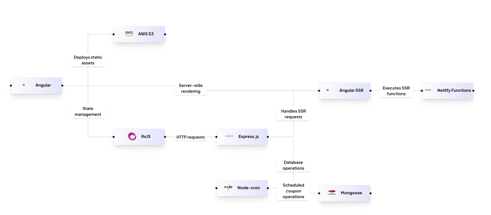
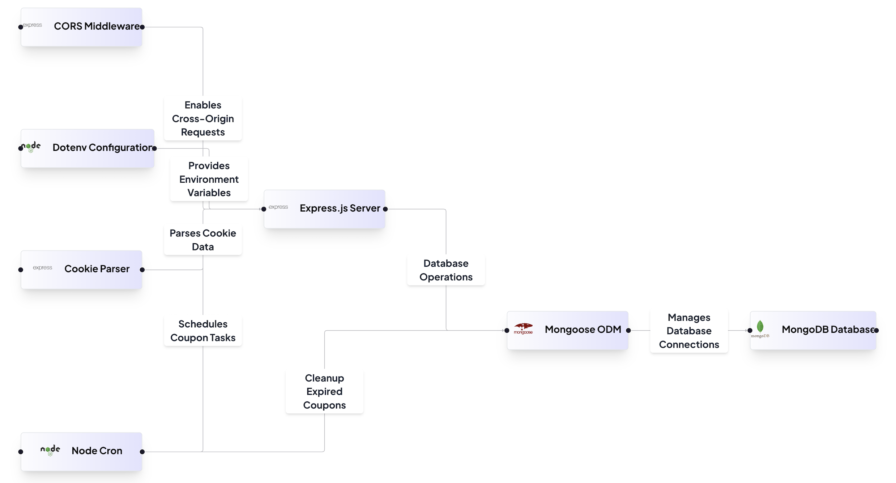
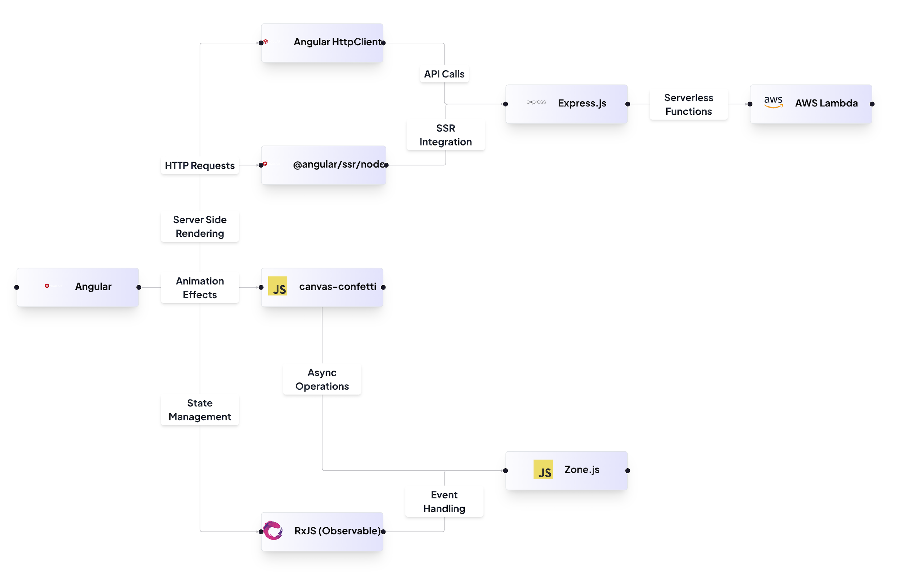

# **Claimify - A Coupon Management System**  

## **Executive Summary**  

### ✅ Increased Operational Efficiency  
- The Claimify application automates the coupon distribution process, reducing manual effort and ensuring seamless operations.  
- The backend service includes scheduled tasks to monitor the coupon inventory and automatically replenish it if the available count drops below a defined threshold (10 coupons).  
- Automation reduces human error and operational bottlenecks.  

### 💰 Cost Savings and ROI  
- By automating coupon management, Claimify reduces overhead costs associated with manual processing.  
- Higher redemption rates directly contribute to increased revenue and improved customer retention.  
- Improved tracking and rate limiting prevent coupon abuse, further enhancing the return on investment (ROI).  

### 🚀 Improved Scalability and Performance  
- The application is built using a modular, component-based architecture, enabling easy scaling and future feature enhancements.  
- Backend services are designed using Node.js and MongoDB to handle high volumes of traffic.  
- Angular’s Server-Side Rendering (SSR) enhances initial load times and improves SEO rankings.  

### 🎯 Enhanced User Experience  
- A visually appealing UI with smooth animations and transitions.  
- An intuitive coupon claiming process supported by real-time feedback and celebratory confetti animation upon successful coupon claim.  
- A countdown timer helps users track when they can claim the next coupon.  

### 🏆 Competitive Advantage  
- Automated coupon distribution ensures consistent availability and boosts customer engagement.  
- Higher redemption rates provide valuable data for refining business marketing strategies.  
- Provides a competitive edge by automating and streamlining customer reward systems.  

---

## Architecture Diagram



## **Feature Summary**  

### 🎟️ **Coupon Distribution Service**  
- Manages the entire lifecycle of a coupon: generation, distribution, expiration cleanup.  
- Uses MongoDB to store coupon data and provides RESTful APIs for coupon claiming and management.  
- Implements rate limiting to prevent abuse and tracks the last claim time for each user.  
- Ensures a minimum of 10 coupons are available at any time through scheduled background tasks.  

---

### 🖥️ **Frontend Application**  
- Built with Angular for a responsive and interactive UI.  
- Displays available coupons and provides an easy-to-use "Claim Coupon" button.  
- Uses HTTP requests to retrieve coupons from the backend service.  
- Triggers celebratory confetti animation upon successful coupon claim.  
- Includes a countdown timer that prevents users from claiming another coupon too quickly.  
- Stores claimed coupon data in the browser’s local storage.  

---

### 🌐 **Server-Side Rendering (SSR)**  
- Uses Angular’s SSR support to improve performance and SEO.  
- Pre-renders the application as static HTML for faster load times.  
- Separates server-side routing from client-side, ensuring seamless navigation.  

---

## **Architecture Overview**  
### **High-Level Architecture**  
1. **Frontend:** Angular (with SSR)  
2. **Backend:** Node.js with Express.js  
3. **Database:** MongoDB  
4. **Scheduler:** Node.js Cron Jobs  
5. **Deployment:** Docker (Optional)  

---

## **Setup Instructions**  

### 🛠️ **Prerequisites**  
Ensure that the following dependencies are installed on your system:  
- Node.js (v18+)  
- MongoDB (v5+)  
- Docker (Optional)  

---

### 📂 **Clone the Repository**  
```bash
git clone https://github.com/your-repo/claimify.git
cd claimify
```

---

### 🚀 **Backend Setup**  

1. **Install Dependencies**  
```bash
cd backend
npm install
```

2. **Create a `.env` File**  
Create a `.env` file in the `/backend` directory and add the following:  
```env
PORT=your-port
MONGO_URI=your_local_mongo_uri
```

3. **Start the Backend Server**  
```bash
npm run start
```
---
## Backend Architecture Diagram


---
### 🌐 **Frontend Setup**  

1. **Install Dependencies**  
```bash
cd frontend
npm install
```

2. **Start the Angular Server**  
```bash
npm run start:ssr
```

## 📁 Project Structure  
```
/src
 ├── app/
 │   ├── components/   # UI components
 │   ├── services/     # API and state management
 │   ├── models/       # Data models
 │   ├── pages/        # Feature pages
 │   ├── app.module.ts # Root module
 ├── assets/           # Static assets
 ├── environments/     # Configuration files
```
---
## Frontend Architecture Diagram


---

## **License**  
MIT License  

---

## **Contributors**  
- [Your Name](https://github.com/your-profile)  
- [Your Teammate](https://github.com/teammate-profile)  

